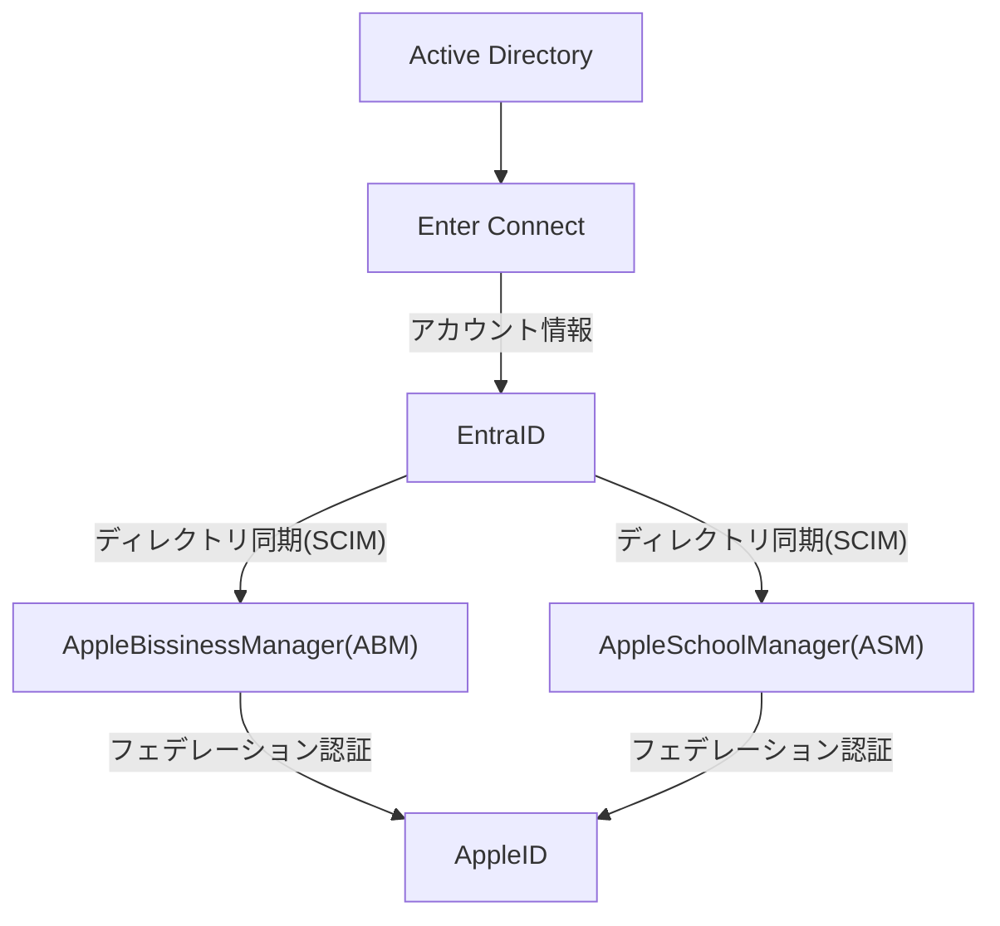

---
tags:
  - 認証/Apple
  - Microsoft365/EntraID
---

# AppleIDをEntraIDと連携させる

## AppleIDとEntraIDの連携

### 構成図

- フェデレーション認証（サインインの連携）
   Entra IDの資格情報（メールアドレスとパスワード）を使ってApple IDにサインインできるようにする設定です。 
	1. ABM/ASMの「設定」>「ディレクトリサービス」で **[Microsoft Entra ID]** を選択します。
    2. Entra IDのグローバル管理者アカウントでサインインし、Appleへのアクセス許可を承認します。
	3. 検証済みドメインに対してフェデレーションを有効化します。

- ディレクトリ同期（SCIMによるアカウント自動作成）
  Entra ID上のユーザー情報をABM/ASMへ自動的に同期し、管理対象Apple IDを自動生成する仕組みです。
	1. Entra ID側で「Apple Business Manager SCIM」などのエンタープライズアプリケーションを作成します。
	2. ABM/ASMから発行されるテナントURLとシークレットトークンをEntra IDに設定します。
	3. 同期するユーザーやグループのスコープを指定して同期を開始します。

### ドメイン所有権が必要

AppleIDと同期させるEntraIDは、同じドメインに参加していて、そのドメインのDNSサーバーにTXTレコードを追加して、Apple指定された文字列を登録する必要があります。

### AppleIDとEntraID連携のメリット

- **シングルサインオン:** ユーザーは社内パスワードをそのまま利用できます。
- **自動プロビジョニング:** Entra IDでユーザーを削除・変更すると、Apple側の管理対象IDも自動で更新されます。
- **セキュリティ向上:** 条件付きアクセスや多要素認証（MFA）をApple IDのサインイン時にも適用可能です。

## オンプレADをAppleIDと連携するには、EntraConnectが必要

2025年時点でオンプレADとAppleIDを連携する方法は無いので、オンプレADはEntraConnectを経由してEntraIDにアカウント情報を連携する必要がある。

## MDMツールが不可欠

EntraIDのアカウントをAppleIDと連携した後は、デバイスの管理にIntuneやJamfなどのMDM（Mobile Device Manager）が不可欠となる。

## ADFSは必要ない
2025年時点でAppleIDはEntraIDと直接連携（EntraIDをIdPとして利用すると言う）出来る（オンプレADとは直接連携出来ない）ので、オンプレADとADFSは必要ない。
その代わり、ADからEntraIDへデータ連携する為の、Microsoft Entra Connectが必要になる。

- **注意:** 確認が完了するまで、そのドメインを用いたフェデレーション（連携）は有効化できません。

## 既存の個人用AppleIDとの競合

１つのメールアドレスに紐づけられるAppleIDは一つなので、個人用AppleIDにメールアドレスを登録していると、会社用AppleIDを同期した時点で、一つのメールアドレスを２つのAppleIDで共有している状態になってしまう。

- 対策１
  60日以内に個人用AppleIDのメールアドレスを変更する。
  60日経過しても変更されなかった場合は、Appleによって暫定的なメールアドレスに変更される。

- 対策２
  会社用AppleIDを同期する前に、個人用AppleIDのメールアドレスを変更する。

いづれにしても個人用AppleIDのメールアドレスは変更する必要がある。

