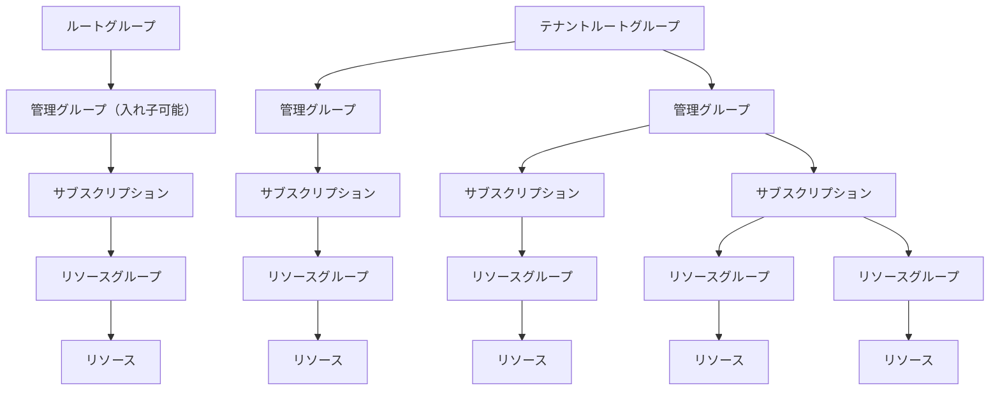

---
tags:
  - Azure
  - 資格試験
---

# AZ-305 出題範囲

[[#1. 25~30% ID、ガバナンス、および監視ソリューションを設計する]]
[[#2. 30~25% データ、ストレージソリューションを設計する]]
[[#3. 15~20% ビジネス継続性ソリューションを設計する]]
[[#4. 30~35% インフラストラクチャ ソリューションを設計する]]

## 1. 25~30% ID、ガバナンス、および監視ソリューションを設計する

### 1-1. ガバナンス設計
- Azureリソースの組織と階層の構造
- コンプライアンスを適用、監視するソリューション

#### 1-1-1. ガバナンスの全体像

#### 1-1-2. Azureリソースの階層
下記の通り４階層になっている。

##### サブスクリプションの使い方
- 課金やコスト算出の単位
- 管理者の単位
- 共通基盤
- 環境種別（本番・開発・テスト）
- ワークロード（アプリ）の単位
- リソース上限の回避
##### リソースグループの使い方
- ライフサイクル別
- アクセス権の単位
- 環境種別（本番・開発・テスト）
- ワークロード（アプリ）の単位
##### タグの使い方
- コスト管理
- 監視
- 管理者・所有者の明確化
- 環境種別（本番・開発・テスト）
- ワークロード（アプリ）の明確化

#### 1-1-3. ガバナンス設計
##### Azure Policy
- 組織ポリシーの強制
- コンプライアンス評価
###### Azure Policyの使い方
1. 特定のSKUのみ使用を許可
2. タグ付けを強制
3. セキュリティパッチの適用
4. 多要素認証を有効化
5. パブリックネットワークへのアクセス無効化
6. コンプライアンス設定
![[Pasted image 20260322112211.png]]
![[Pasted image 20260322113242.png]]

##### Azure RBAC
- Azureリソースへのアクセス権
- 操作権限の管理
###### Azure Role Base Access Control（RBAC）の使い方
1. 最小権限の原則（JEA）
2. Just In Timeアクセス（JIT）
3. グループへのロール割り当て
![[Pasted image 20260322113552.png]]
###### Azure PolicyとRBACの使い分け
RBAC側（許可する）
- ユーザーにはデプロイ権限を与える
- 対象のリソース種別の操作権限を与える
- 対象のリソースグループの操作権限を与える
Azure Policy側（禁止する）
- デプロイ可能なリージョンを制限する
- リソース種別を制限する
- 必須のタグ付与を自動実行する（要確認）
![[Pasted image 20260322124036.png]]

#### 1-1-4. ランディングゾーン
[Azure ランディング ゾーンとは（公式） - Cloud Adoption Framework | Microsoft Learn](https://learn.microsoft.com/ja-jp/azure/cloud-adoption-framework/ready/landing-zone/)
Azureを大規模に導入・管理する組織が、一貫した方法で実施できるようにまとめたドキュメント。[８つの設計領域](https://learn.microsoft.com/ja-jp/azure/cloud-adoption-framework/ready/landing-zone/design-areas)の[設計原則](https://learn.microsoft.com/ja-jp/azure/cloud-adoption-framework/ready/landing-zone/design-principles)を提供します。
![[Pasted image 20260322120212.png]]

### 1-2. 認証と認可のソリューションを設計する
- ロールベースのアクセス制御でリソースをセキュリティ保護するためのソリューション
- ID管理ソリューション
- IDをセキュリティ保護するためのソリューション

### 1-3. アプリケーションのIDとアクセスを設計する
- アプリケーションからAzureリソースにアクセス可能なソリューション
- パスワードとシークレットを安全に格納するソリューション
- アプリケーションをMicrosoft EntraIDに統合するソリューション
- アプリケーションのユーザー同意ソリューション

### 1-4. ログと監視のためのソリューションを設計する
- ログルーティングソリューション
- 適切なレベルのログ記録
- ソリューションの監視ツール

[[#AZ-305 出題範囲]]へ戻る

## 2. 30~25% データ、ストレージソリューションを設計する
[[#AZ-305 出題範囲]]へ戻る

## 3. 15~20% ビジネス継続性ソリューションを設計する
[[#AZ-305 出題範囲]]へ戻る

## 4. 30~35% インフラストラクチャ ソリューションを設計する
[[#AZ-305 出題範囲]]へ戻る
