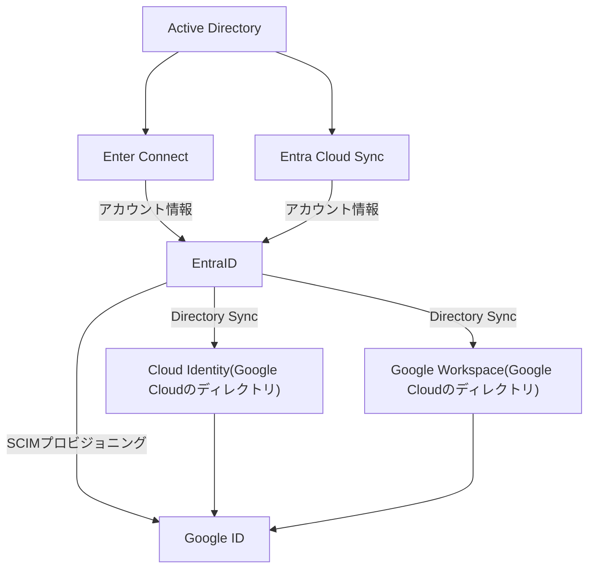
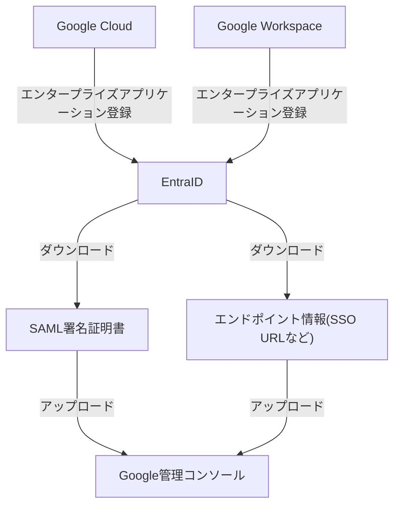

---
tags:
  - 認証/GoogleID
  - Microsoft365/EntraID
---

# GoogleアカウントとEntraIDの連携

## GoogleアカウントとEntraIDの連携

### 構成図

#### ユーザーアカウントとグループ同期（プロビジョニング）

ADのユーザー情報をEntra ID、そしてGoogle IDへと同期させます。

- **ADとEntra IDの同期**
   オンプレミスのADユーザーをMicrosoft Entra Connect（またはEntra Cloud Sync）を使用してEntra IDに同期します。これにより、両方のディレクトリ間でID情報が連携されます。
- **Entra IDとGoogle IDの同期**
	- **Directory Sync**
	   Googleが提供する「Directory Sync」ツールを使用して、Entra IDのユーザー/グループデータをGoogle Cloudのディレクトリ（Cloud IdentityまたはGoogle Workspace）に同期できます。
	-  **SCIMプロビジョニング**
	   Entra IDのエンタープライズアプリケーション機能を利用して、SCIM（System for Cross-domain Identity Management）プロトコルに基づき、ユーザーをGoogle IDへ自動プロビジョニング（作成、更新、削除）することも可能です。

#### SAML（Security Assertion Markup Language）連携

ユーザーがEntra IDの認証情報を使用してGoogleサービスにログインできるようにします。

- **SAML連携**
  Google Workspace（またはCloud Identity）をサービスプロバイダー (SP) とし、Microsoft Entra IDをIDプロバイダー (IdP) としてSAML (Security Assertion Markup Language) 認証を設定します。
- **手順**
	1.  Entra IDでGoogle Cloud/Google Workspaceをエンタープライズアプリケーションとして登録します。
	2. Entra IDからSAML署名証明書やエンドポイント情報（SSO URLなど）をダウンロードします。
	3. Google管理コンソールでSAMLプロファイルを設定し、ダウンロードした証明書などの情報をアップロードします。
	4. ユーザー属性（メールアドレスなど）のマッピングが正しく行われていることを確認します。

## 詳細な手順とガイダンス

GoogleとMicrosoftの公式ドキュメント
- **Google Cloud ドキュメント**
  Microsoft Entra IDとGoogle Cloudを連携させる際のアーキテクチャや設定手順について、[Google Cloud のドキュメント](https://docs.cloud.google.com/architecture/identity/federating-gcp-with-azure-active-directory?hl=ja)で詳しく説明されています。
- **Microsoft Learn**
  Entra ID側の設定については、[Microsoft Learn](https://learn.microsoft.com/ja-jp/entra/identity/saas-apps/google-apps-tutorial)にGoogle Cloud/Google Workspaceアプリケーションのチュートリアルがあります。

## Entra Cloud Syncとは

- EntraConnectに代わる新しい方式。ADサーバーに軽量なエージェントを導入するだけでEntraIDと動機構成・管理が出来るため、専用サーバーが不要。
- 同期構成・管理は全てクラウド（EntraID）側で行う。

### 特徴とメリット

#### 軽量エージェント
Windows Serverに「Cloud Sync Agent」をインストールするだけで利用可能で、専用サーバーが不要です。

#### クラウド管理
同期ルールや状態はすべてMicrosoft Entra ID上で管理され、ポータルから設定できます。

#### **複数ドメイン対応**
複数のActive Directoryドメインを単一のEntra IDテナントに同期するのに適しており、管理が容易です。

#### **柔軟な同期**
同期する属性のマッピングを細かくカスタマイズでき、オンデマンドでの同期テストも可能です。

#### **段階的な移行**
従来のEntra Connect Syncからクラウド同期への移行パスが提供されており、段階的に導入できます。

### 参考

- [Entra ConnectのEntra同期とクラウド同期の違い – エンジニアベース Tech Blog](https://blog.engineer-base.jp/entra-cloud-sync-difference/)
- [【Entra ID ハンズオン】Microsoft Entra Connect クラウド同期 (Cloud Sync) #Microsoft365 - Qiita](https://qiita.com/mokonacl/items/2b5d141728707762ae3f)
- [Microsoft Entra クラウド同期 徹底解説 - しくみ - Microsoft Entra ID | Microsoft Learn](https://learn.microsoft.com/ja-jp/entra/identity/hybrid/cloud-sync/concept-how-it-works)

