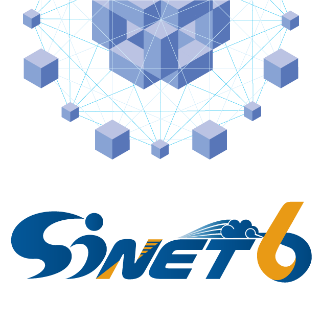

# 広域LAN接続(UNO)経由で接続する - SINET6 - Science Information NETwork 6

[https://www.sinet.ad.jp/connect_service/access_environment/connect_uno](https://www.sinet.ad.jp/connect_service/access_environment/connect_uno)

## 広域LAN接続サービス — NTT-Com UNO網

「広域LAN接続」とは、NTTコミュニケーションズのArcstar Universal One(UNO)サービス(以下NTT-Com UNO網)を利用したSINETへの接続形態を指します。

SINETへの接続を経済的に行いたい機関のための接続方法です。

利用可能帯域(非公開)が限られているため、最新の学術情報ネットワークの利点を十分には活用できませんが、国内外の学術研究ネットワーク接続機関との間で、商用インターネットを介さない通信が可能です。

UNO網は、SINET6の東京地区および大阪地区ででSINETと接続されています。

加入機関は、UNO網までの足回り回線を用いて、UNO網経由でSINETに接続することができるため、SINETノードへの回線引き込みは不要です。

**本方式でのご利用いただけるサービスは、インターネット接続（IPv4/IPv6 Dual）サービスのみとなっております。**

「広域LAN接続サービス – NTT-Com UNO網」を利用するためには、NTTコミュニケーションズへのお申込みが必要です。

※前提として、接続にはSINETへの加入が必要となります。

## 接続の準備

- UNO網までの足回りアクセス回線をご用意下さい。
- 足回りのアクセス回線として以下のような複数の回線種別から選択ができます。
    - POI(UNO網の接続ポイント)までの専用回線等
    - フレッツ回線(地域IP網)
- VLANに対応した機器が必要です。

## 接続申請の流れ

## 注意事項・備考

### 接続用VLAN-ID

- 「広域LAN接続」では、タグVLAN(IEEE802.1Q)の設定が必要になります。
- 接続用VLAN-IDは、 接続承認書に記載してご連絡します。 ご用意したVLAN-IDに不都合がある場合にはご相談ください。

### 接続にかかる経費

- POIまでのアクセス回線等の料金については、加入機関の負担になります。 詳しくはNTTコミュニケーションズの担当窓口へお問合せください。

### NTT-Com 問合せ・申込み先

- NTTコミュニケーションズ SINET「広域LAN接続サービス」受付窓口 (第二ビジネスソリューション部SINET担当)
- TEL: 050-3665-0166
- e-mail: sinet-am-st[@]ntt.com
- 受付: 平日10:00-17:00