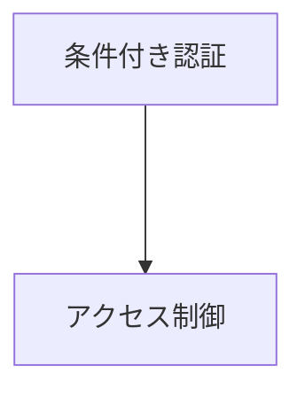

---
tags:
  - セキュリティ/ゼロトラストセキュリティ
---

# ゼロトラストセキュリティ

## ガートナー
- [ゼロトラストとは？意味や概念、必要とされている理由をわかりやすく解説 | ガートナージャパン（Gartner）](https://www.gartner.co.jp/ja/topics/zero-trust)
- [Gartner、ゼロトラストの最新トレンドを発表](https://www.gartner.co.jp/ja/newsroom/press-releases/pr-20250508-zero-trust)
- [Gartner、2026年にITリーダーが注目すべきネットワーク・トレンドを発表](https://www.gartner.co.jp/ja/newsroom/press-releases/pr-20251204-network-trend)

## Microsoft
- 

## SRMリーダーが注目すべき用語
- SRM：セキュリティ/リスク・マネジメント
- SASE：
- SSE：
- CTEM：ASMを基にリスク評価、対策、検証、改善を継続的に行うプロセス。
- ASM：アタックサーフェス管理：外部に公開されている攻撃対象の可視化と脆弱億艇

## EntraID

