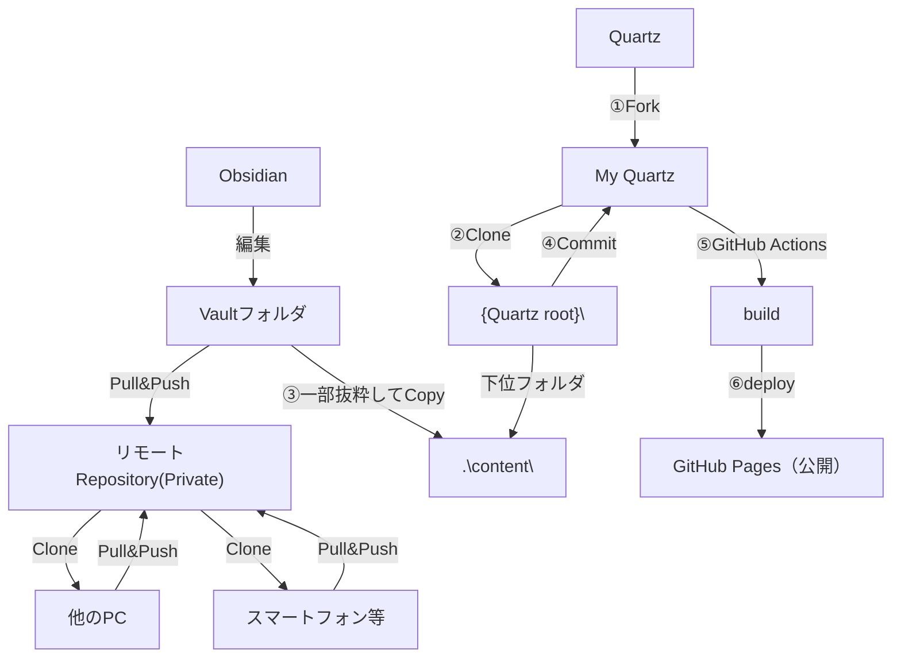

---
tags:
  - Obsidian
---

```table-of-contents
```

## Obsidian+Quartz+GitHubPagesで躓いた所の話

### 本ページの内容
-  Quartzの機能や役割についてはAIに聞いたほうが早いので書きません。AIで壁打ちしてQuartzを使おうとなってからの話を書いています。

- また、構築手順を書いてもそのとおりにはならない事が多いのと、バージョンが変わると意味が無くなるので書きません。ChatGPTとCopilotに教えて貰いながら構築しました。

- 躓いた時に調べたことや役に立った知識について書いていきます。使用したURLも載せます。


### QuartzとObsidianVaultを結合させる
Quartzは自分のGitHubアカウントにForkして使用します。Fork後ローカルにcloneして、Obsidian Vaultを格納するのですが、その場所が「<Quartz フォルダ>\content\」配下になります。

Quartzをcloneした配下のフォルダになるため、Vaultを直接clone出来ません。

別の場所にcloneしてから必要なファイルだけcopyしました。
結果、以下の図のようにとても複雑なフローになっています。
（svn exportみたいなやり方あれば教えてください…）

- QuartzにObsidian Vaultを取り込む流れ


### QuartzにコミットしてActionsをトリガーする
GitHubActionsをトリガーするには条件があります。
1. 対象のGitHubリポジトリがPublicになっていること。
   Setting > Change repository visibility（下の方） > Public
2. 対象のGitHubリポジトリのPages設定がActionsになっていること。
   Setting > Pages > Build and deployment > Source = GitHub Actions
3. Quartzのbuildに使用するnode.jsのバージョンが正しいこと。
   buildする時、コンテナ内のnode.jsを使用するらしく、バージョンの指定が必要になるらしい。
4. Pullする先のBranchが「deploy.yaml」のbranchesと一致していること。

- deploy.yamlのbranches
![[20_テーマに基づくメモ/ノート術/deploy_yaml_branches.png.png]]

- deploy.yamlのnode-version
![[20_テーマに基づくメモ/ノート術/deploy_yaml_version.png.png]]

上記4点が一致していると、Pullした後で上部メニューのActionsを開くとBuildがトリガーされて処理中になっているはずです。

### QuartzのBuildを完了させる
この部分はトライ・アンド・エラーになりました。

基本はbuildログをChatGPTに貼り付けて原因を聞くのですが、言いなりになっていると堂々巡りに遭います。そこで、エラー原因を読んだらワークフロー（buildの手順）が原因なのか、config（Quartzの設定）が原因なのか考えて必要な箇所だけChatGPTの指示を取り込みました。

あまりに話が噛み合わなくなったら、現在のquartz.config.ts（Quartzのコンフィグ）とdeploy.yaml（ワークフロー）を全文貼り付けて覚えて貰いました。

#### quartz.config.tsファイル
quartzの設定ファイルです。使用する色やプラグインの設定を書くファイルです。

実行されるプラグインが多いとbuildとdeployに時間がかかるので、安定するまでは最小構成にして、安定してからプラグインの設定をしていきます。
特に

#### deploy.yamlファイル
quartzをGitHub Actionsで動かすためのワークフローファイルです。

これは動けばよいので、ChatGPTに書き直してもらいました。修正してPushしてGitHub Actionsのbuildとdeployの状況を見て、エラーが出たらログをChatGPTに貼って原因と対策を聞く。

納得が行く修正なら取り込み、納得が行かない場合はChatGPTと相談する…　という繰り返しで作りました。元々のファイルと比較すると殆ど書き換えていて原型がありませんでした。

### QuartzのDeployを成功させてGitHub Pagesに表示する
Actionsの左上にジョブ名のリストがあるので、Actionsで実行したいdeploy.yamlの名前（name: がジョブ名）を選択すると右側にログが表示されるので、最新の１つをクリックすると詳細が確認できます。

- ワークフローのジョブ名
![[20_テーマに基づくメモ/ノート術/deploy_yaml_name.png.png]]

- ジョブの詳細を見る
![[20_テーマに基づくメモ/ノート術/Actions_jobname.png.png]]

- buildとdeployがグリーンになっていることでStaticページはGitHub Pagesに展開される
![[20_テーマに基づくメモ/ノート術/Actions_jobdescription.png.png]]

ここまで行ってもGitHub PagesにHTMLが格納されていない事があります。
それはbuildで生成されたHTMLが出力されるディレクトリと、deploy.yamlのartifactに書かれたパスが一致していない場合です。
ワークフローのBuild Quartz siteの下にデバッグライトの２行を追加して、ジョブ実行時のログから読み取ります。

- deploy.yamlのpathが書かれている箇所
![[20_テーマに基づくメモ/ノート術/deploy_yaml_path.png.png]]

- buildでどのパスに出力されるか確認する方法（-を忘れずに付けて下さい、ジョブの区切りになっています）
![[20_テーマに基づくメモ/ノート術/Pasted image 20260113233020.png]]

### リンク切れ対策
最後にObsidianは階層構造を持つことが出来ますが、Quartzの初期の設定では対応していません。
そこで、QuartzとObsidian両方に設定が必要になります。

…続く

### 使用したURL
以下の事を理解して躓きを減らす為に、URLを貼っておきます。（必ず最新を確認して下さい）
- Quartz の各種設定の意味
- ビルドと出力の仕組み
- GitHub Actions での Pages 自動デプロイ
- 必要なパーミッション設定

Quartzの資料
- Quartz公式サイト
  [Welcome to Quartz 4](https://quartz.jzhao.xyz/?utm_source=chatgpt.com)
- QuartzConfigureリファレンス
  [Configuration](https://quartz.jzhao.xyz/configuration?utm_source=chatgpt.com)
- QuartzLayoutリファレンス
  [Layout](https://quartz.jzhao.xyz/layout?utm_source=chatgpt.com)
- Hosting / Deployment 公式ガイド
  [Hosting](https://quartz.jzhao.xyz/hosting?utm_source=chatgpt.com)
- QuartzGitHubリポジトリ
  [jackyzha0/quartz: 🌱 a fast, batteries-included static-site generator that transforms Markdown content into fully functional websites](https://github.com/jackyzha0/quartz?utm_source=chatgpt.com)

GitHub Actionsの資料
- GitHub Actions deploy-pages
  [actions/deploy-pages: GitHub Action to publish artifacts to GitHub Pages for deployments](https://github.com/actions/deploy-pages?utm_source=chatgpt.com)
- GitHub Pages 公式
  [GitHub Pages documentation - GitHub Docs](https://docs.github.com/en/pages)


### 番外：よく使用したgitコマンド
1. ローカルリポジトリを作成する
   ``` bash
   git init
   git add .
   git commit -m "Initial commit"
   git branch -M main
   git remote add origin https://github.com/<user name>/<repository name>.git
   git push -u origin main
   ```
2. リモートリポジトリの確認
   ``` bash
   git remote -v
   ```
3. カレントディレクトリにGitHubからクローンする
   ``` bash
   git clone https://github.com/<user name>/<ripository name>.git
   ```
4. リモートリポジトリを登録
   ``` bash
   git remote add origin https://github.com/<user name>/<repository name>.git
   ```
5. リモートリポジトリを変更
   ``` bash
   git remote set-url origin https://github.com/<user name>/<repository name>.git
   ```
6. 現在の状態を確認
   ``` bash
   git status
   ```
7. ブランチの状態を確認
   ``` bash
   git branch -a
   ```   
8. カレントディレクトリの変更ファイルをコミットしてプッシュ
   ``` bash
   git add .
   git commit -m "コミットメッセージ"
   git push origin v4        # ローカルブランチがoriginで、リモートブランチがv4の場合
   ```


